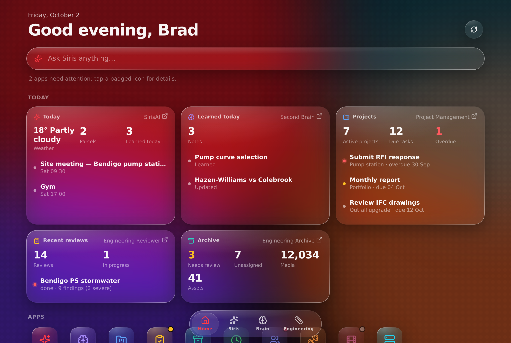

# SirisOS

SirisOS is the home screen for the Siris family of self-hosted apps. It is
a Liquid Glass web app (an installable PWA) that shows every app as a live
tile and puts their data on one screen as widgets. SirisAI is built in as
the system assistant and Second Brain as the notes layer. SirisOS also
keeps the engineering tools that no other app owns.

**Complement, not replace.** SirisOS does not rebuild what another app
already does well. SirisAI owns the assistant, memory and home
integrations. Second Brain owns notes and knowledge. APD PM owns project
management. JEFIT owns the gym, Helmarr owns media and Neo Server owns the
homelab. SirisOS links to all of them, monitors them and surfaces their
data. See [ADR 106](docs/adr/106-sirisos-hub.md).

This README is the project handover and [`docs/roadmap.md`](docs/roadmap.md)
is the checklist. Update both whenever scope or status changes. The
pre-hub README and roadmap are kept in [`docs/history/`](docs/history/).



## Architecture

```text
 iPhone / browser ── PWA (apps/web: React + TS, Liquid Glass)
        │  one origin, JWT
        ▼
 sirisos container :8094 ── nginx ──► static PWA
                              └─► /api ─► FastAPI (apps/backend)
                                          ├─ hub gateway (connectors)
                                          │    ├─ SirisAI + Second Brain  (bearer key)
                                          │    ├─ APD PM :8080            (service login)
                                          │    ├─ Engineering Reviewer :8082
                                          │    ├─ Engineering Archive :8091 (X-API-Key)
                                          │    ├─ GVW Timesheets :8092    (health)
                                          │    ├─ CMP Capabilities :8093  (service login)
                                          │    └─ Helmarr / JEFIT / Neo Server (launch tiles)
                                          └─ engineering module
                                               SirisHydro · calculators · Standards · Projects
 postgres (separate container)
```

The browser only talks to SirisOS. Each app's credentials stay on the
server, and every connector reports its own state (`ok`, `degraded`,
`down` or `unconfigured`), so a dead app blanks its own tile and nothing
else.

## Deploy

```bash
git pull
make up          # builds the PWA + API image and starts the stack on :8094
```

Copy `.env.example` to `.env` and fill in the connector section. Any app
left blank shows as "not configured" and is otherwise ignored.

| Variable | Purpose |
| --- | --- |
| `SIRISOS_PORT` | Host port (default `8094`; `6464` is now dad-joke-of-the-day) |
| `SIRISAI_URL`, `SIRISAI_API_KEY`, `SIRISAI_PUBLIC_URL` | Assistant, HUD and Second Brain. `SIRISAI_URL` is how the container reaches SirisAI. `SIRISAI_PUBLIC_URL` is the link your phone opens |
| `APD_PM_URL`, `APD_PM_EMAIL`, `APD_PM_PASSWORD` | Project widget. Use a dedicated VIEWER account |
| `REVIEWER_URL` (+ optional `REVIEWER_USERNAME`/`REVIEWER_PASSWORD`) | Engineering Reviewer |
| `ARCHIVE_URL`, `ARCHIVE_API_KEY` | Engineering Archive (a `read`-scope key) |
| `GVW_URL` | GVW Timesheets |
| `CMP_URL`, `CMP_EMAIL`, `CMP_PASSWORD` | CMP Capabilities |
| `HELMARR_URL`, `JEFIT_URL`, `NEO_SERVER_URL` | Launch targets. App URL schemes are fine |

Each app also has a `*_PUBLIC_URL`. It defaults to the same value as `*_URL`
and is the address the launch link opens on your device.

## Development

```bash
make backend     # Postgres + API on :8000
make dev         # API container + Vite dev server for apps/web (proxies /api)
cd apps/backend && pytest -q
cd apps/web && npm test && npm run build
```

## Repository layout

- `apps/backend`: FastAPI. `app/hub/` is the connector gateway; the
  engineering module is `app/api/sirishydro.py`,
  `engineering_calculations.py`, `engineering_standards.py` and
  `projects.py`.
- `apps/web`: the React/TypeScript PWA and its Liquid Glass design system.
- `docs/adr`: one ADR per decision. The newest is 106.
- `deploy/`: nginx and supervisord config for the single app container.

## Status

The hub rebuild runs in phases, each merged to `main` when it lands. See
[`docs/roadmap.md`](docs/roadmap.md).
